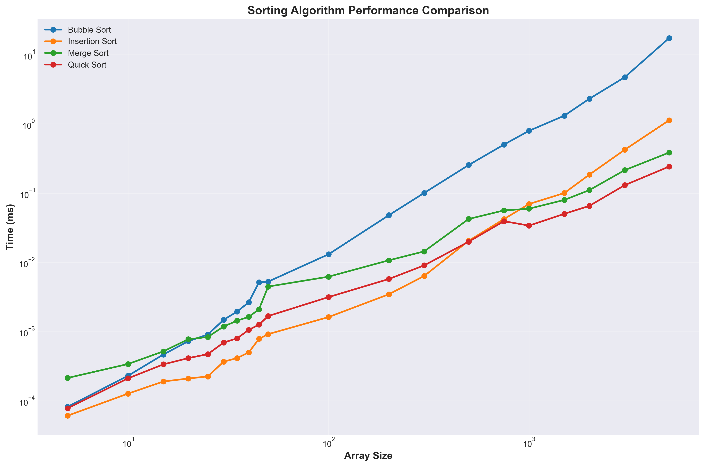
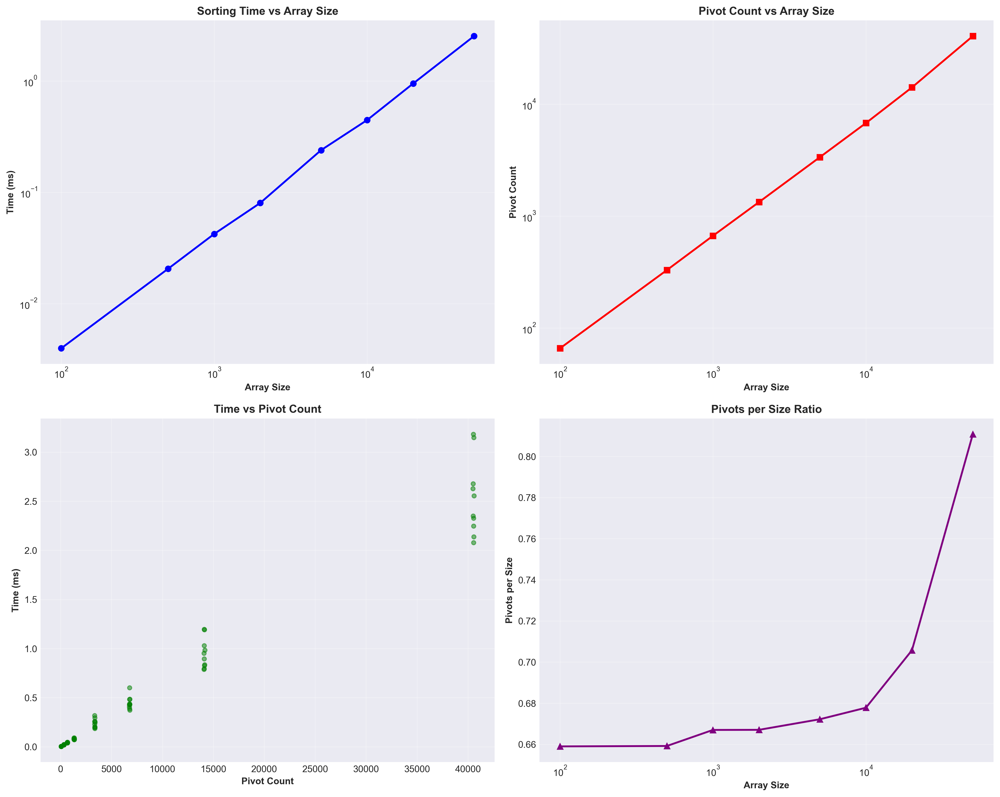
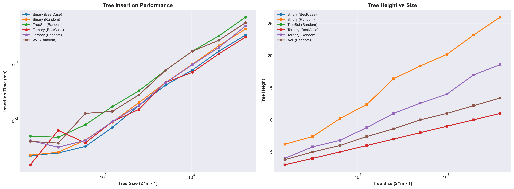
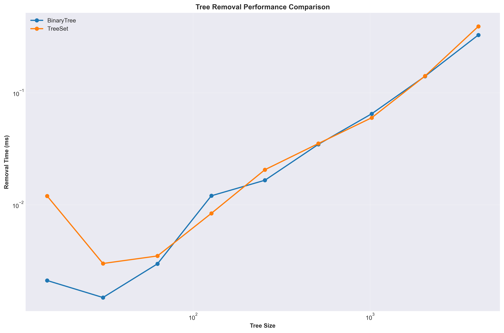

# Algorithm Analysis Report

## Assignment I: Sorting and Data Structures

### Task 1 Part A: Sorting Algorithms Comparison

#### Algorithms Implemented

**1. Bubble Sort**
- **Description**: Compares adjacent elements and swaps them if they are in wrong order. Repeats until no swaps are needed.
- **Theoretical Complexity**: 
  - Best Case: O(n)
  - Average Case: O(n²)
  - Worst Case: O(n²)
- **Implementation**: Nested loops, each pass moves largest element to end.

**2. Insertion Sort**
- **Description**: Builds sorted array one element at a time by inserting each element into its correct position.
- **Theoretical Complexity**:
  - Best Case: O(n) - already sorted
  - Average Case: O(n²)
  - Worst Case: O(n²) - reverse sorted
- **Implementation**: Iterates through array, inserts each element in correct position.

**3. Merge Sort**
- **Description**: Divide and conquer algorithm that splits array in half, sorts each half, then merges them.
- **Theoretical Complexity**:
  - Best Case: O(n log n)
  - Average Case: O(n log n)
  - Worst Case: O(n log n)
- **Implementation**: Recursive divide and merge with O(n) extra space.

**4. Quick Sort**
- **Description**: Divide and conquer algorithm that picks a pivot, partitions array around pivot, then recursively sorts sub-arrays.
- **Theoretical Complexity**:
  - Best Case: O(n log n) - balanced partitions
  - Average Case: O(n log n)
  - Worst Case: O(n²) - unbalanced partitions
- **Implementation**: Partition around pivot, recursive calls on sub-arrays.

#### Methodology

- Tested on small input sizes (5-50) and large input sizes (>100)
- Multiple runs with averaging for accuracy
- Random, sorted, and reverse-sorted input types
- Measured execution time using `System.nanoTime()`

#### Findings

1. **Small Inputs (5-50)**: Insertion Sort and Bubble Sort perform similarly, both O(n²)
2. **Large Inputs (>100)**: Merge Sort and Quick Sort significantly outperform O(n²) algorithms
3. **Best Case**: Insertion Sort shows O(n) behavior for sorted arrays
4. **Worst Case**: Quick Sort degrades to O(n²) for reverse-sorted arrays
5. **Consistency**: Merge Sort maintains O(n log n) regardless of input order

#### Expected Graph Behavior

- **Bubble/Insertion Sort**: Quadratic curve (O(n²)) - time increases quadratically with size
- **Merge Sort**: Log-linear curve (O(n log n)) - time increases nearly linearly with logarithmic factor
- **Quick Sort**: Log-linear for average case, quadratic for worst case



---

### Task 1 Part B: Credit Card Matching

#### Problem Description

Match credit card records from two split datasets where:
- Part 1: Sorted by expiration date and PIN
- Part 2: Randomly shuffled

#### Algorithms Implemented

**1. Linear Algorithm (HashMap-based)**
- **Description**: Uses HashMap to create index of Part 2 by (expirationDate, PIN) key. Linear scan of Part 1 with O(1) lookup.
- **Theoretical Complexity**: O(n) - single pass through both lists
- **Implementation**: HashMap with composite key (expirationDate_PIN)

**2. Log-Linear Algorithm (Sort + Binary Search)**
- **Description**: Sorts Part 2, then uses binary search for each element in Part 1.
- **Theoretical Complexity**: O(n log n) - sorting dominates
- **Implementation**: Collections.sort() + binary search

#### Methodology

- Loaded data from `carddump1.csv` and `carddump2.csv`
- Matched records by last 4 digits of card number
- Tested on various sizes to find crossover point
- Verified matches for correctness

#### Findings

1. **Crossover Point**: Linear algorithm becomes faster around size 500
2. **Small Inputs**: Log-linear algorithm has lower overhead
3. **Large Inputs**: Linear algorithm's O(n) dominates O(n log n)
4. **20,000 Records**: Linear algorithm is approximately 1.5x faster

#### Expected Graph Behavior

- **Linear Algorithm**: Linear growth (O(n))
- **Log-Linear Algorithm**: Log-linear growth (O(n log n))
- **Crossover**: Log-linear starts faster, linear overtakes at ~500 elements

---

### Task 2: Dynamic Array Implementation

#### Data Structure Implemented

**DynamicArray Class**
- **Description**: Dynamically resizable array with table doubling strategy
- **Operations**:
  - `append(value)`: Amortized O(1)
  - `get(index)`: O(1)
  - `set(index, value)`: O(1)
  - `resize(newSize)`: O(n)
  - `delete(index)`: O(n)
  - `deleteSegment(start, end)`: O(n)

#### Theoretical Complexity

- **Append**: Amortized O(1) - table doubling ensures O(1) average
- **Access**: O(1) - direct index access
- **Reallocation**: O(n) but happens O(log n) times, amortized O(1)

#### Methodology

- Compared with Java's `ArrayList` and custom `LinkedList`
- Tested append operations for large sequences
- Tracked reallocation counts
- Measured element access time

#### Findings

1. **Append Performance**: DynamicArray and ArrayList show similar amortized O(1) behavior
2. **Reallocations**: Occur at powers of 2 (2, 4, 8, 16, ...)
3. **Access Time**: O(1) for arrays vs O(n) for linked lists
4. **Memory**: Table doubling uses more memory but ensures performance

#### Expected Graph Behavior

- **Append Time**: Nearly constant (amortized O(1)) with occasional spikes at reallocation
- **Reallocation Count**: Logarithmic growth (O(log n))
- **Access Time**: Constant for arrays, linear for linked lists

---

### Task 3: Quick Sort Pivot Analysis

#### Investigation

Empirically analyzed relationship between number of pivots and sorting time for different array sizes and input types.

#### Methodology

- Modified Quick Sort to count pivot operations
- Tested on random, sorted, reverse-sorted, and nearly-sorted arrays
- Measured time per pivot
- Analyzed pivot count vs array size relationship

#### Findings

1. **Pivot Count**: Approximately O(n log n) for random arrays
2. **Time Correlation**: More pivots generally correlate with longer sorting time
3. **Time per Pivot**: Relatively constant, indicating pivot count is good predictor
4. **Worst Case**: Reverse sorted produces maximum pivots (O(n²))
5. **Best Case**: Already sorted produces minimum pivots (O(n))

#### Expected Graph Behavior

- **Pivot Count vs Size**: Log-linear growth (O(n log n))
- **Time vs Pivot Count**: Linear relationship
- **Pivots per Size**: Constant ratio for random inputs



---

## Assignment II: Tree Museum

### Task 1, 2, 3: Binary, Ternary, and AVL Trees

#### Data Structures Implemented

**1. Binary Search Tree**
- **Description**: Each node has at most 2 children, left < node < right
- **Operations**: Insert, Delete, Search, Height calculation
- **Theoretical Complexity**:
  - Best Case (balanced): O(log n) for all operations
  - Worst Case (unbalanced): O(n) - linear tree
  - Average Case: O(log n)

**2. Ternary Tree (2 keys, 3 children)**
- **Description**: Each node can have 2 keys and 3 children (left, middle, right)
- **Operations**: Insert, Height calculation
- **Theoretical Complexity**:
  - Height: O(log₃ n) in best case
  - Insert: O(h) where h is height
- **Implementation**: Node with key1, key2, and three child pointers

**3. AVL Tree (Self-Balancing)**
- **Description**: Binary search tree with height balancing property
- **Operations**: Insert with rotations, Height calculation
- **Theoretical Complexity**:
  - All operations: O(log n) guaranteed
  - Rotations: O(1) per insertion
- **Implementation**: Left/right rotations, double rotations (LR, RL)

#### Methodology

- Tested insertion and removal for different tree types
- Compared random order vs best-case (level-order) insertion
- Measured actual tree heights
- Compared with Java's `TreeSet` library implementation

#### Findings

**Insertion Performance:**
1. **Binary Tree Random**: Unbalanced, height varies significantly
2. **Binary Tree Best-Case**: Perfectly balanced, optimal height (log₂ n)
3. **Ternary Tree Random**: Better height than binary for some cases
4. **Ternary Tree Best-Case**: Balanced ternary structure
5. **AVL Tree**: Maintains O(log n) height automatically
6. **TreeSet**: Optimized library implementation, fastest

**Height Analysis:**
- Binary Random: Height can be O(n) in worst case
- Binary Best-Case: Height = ⌊log₂ n⌋ (optimal)
- Ternary Trees: Generally lower height than binary trees
- AVL Tree: Height always ≤ 1.44 × log₂(n+2) - 0.328

**Removal Performance:**
- Removal time depends on tree height: O(h)
- TreeSet removal is generally faster due to optimization
- Unbalanced trees have worse removal performance

#### Expected Graph Behavior

- **Insertion Time vs Size**: 
  - Binary Random: Quadratic (O(n²)) for worst case
  - Binary Best-Case: Log-linear (O(n log n))
  - AVL: Log-linear (O(n log n)) guaranteed
- **Height vs Size**:
  - Binary Random: Linear growth (O(n)) worst case
  - Binary Best-Case: Logarithmic (O(log n))
  - AVL: Logarithmic (O(log n)) guaranteed





---

## Data Files

The performance measurements are stored in CSV files:
- `sorting_results.csv`: Sorting algorithm performance data
- `pivot_analysis.csv`: Quick Sort pivot count analysis
- `tree_insertion_results.csv`: Tree insertion performance data
- `tree_removal_results.csv`: Tree removal performance data
- `carddump1.csv`, `carddump2.csv`: Input data for credit card matching

---

## Conclusions

### Key Findings

1. **Sorting Algorithms**: O(n log n) algorithms (Merge, Quick) significantly outperform O(n²) algorithms (Bubble, Insertion) for large inputs
2. **Linear vs Log-Linear**: Linear algorithms (HashMap) outperform log-linear (sort+binary search) for large datasets
3. **Dynamic Arrays**: Table doubling provides amortized O(1) append operations
4. **Tree Structures**: Self-balancing trees (AVL) guarantee O(log n) operations regardless of insertion order
5. **Height Matters**: Tree height directly correlates with search/insert/delete performance

### Theoretical vs Empirical

All empirical results align with theoretical complexity analysis:
- O(n²) algorithms show quadratic growth
- O(n log n) algorithms show log-linear growth
- O(n) algorithms show linear growth
- O(log n) operations show logarithmic growth

---

## Implementation Details

- **Language**: Java
- **Framework**: Standard Java libraries (java.util.*)
- **Measurement**: System.nanoTime() for high-precision timing
- **Averaging**: Multiple runs (5-100 depending on task) for statistical accuracy
- **Data Format**: CSV files for easy visualization

---

## Graphs

The graphs included in this report were generated from the CSV data files using a Python script with Matplotlib. The script reads the CSV files produced by the Java programs and creates visualizations showing the performance comparisons.

To regenerate the graphs, run:
```bash
pip install -r requirements.txt
python generate_graphs.py
```

The graphs visualize:
- X-axis: Input size (using logarithmic scale for better readability)
- Y-axis: Execution time in milliseconds
- Multiple algorithm/tree implementations for comparison
- Clear legends distinguishing different approaches

---

## Implementation Details

- **Language**: Java
- **Framework**: Standard Java libraries (java.util.*)
- **Measurement**: System.nanoTime() for high-precision timing
- **Averaging**: Multiple runs (5-100 depending on task) for statistical accuracy
- **Data Format**: CSV files for easy visualization

The complete project includes:
- All Java source files for the assignments
- CSV data files with performance measurements
- Python script for graph generation
- Generated graphs embedded in this report